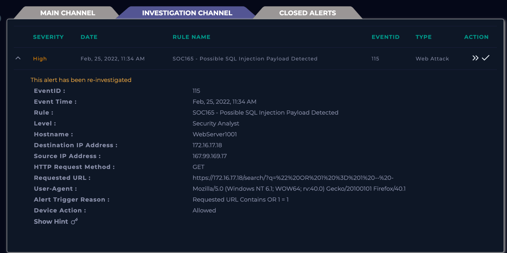
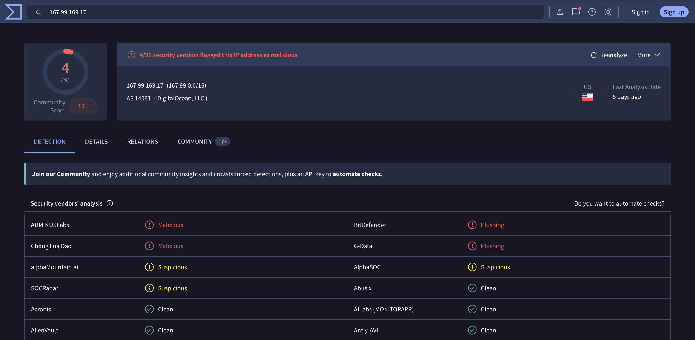
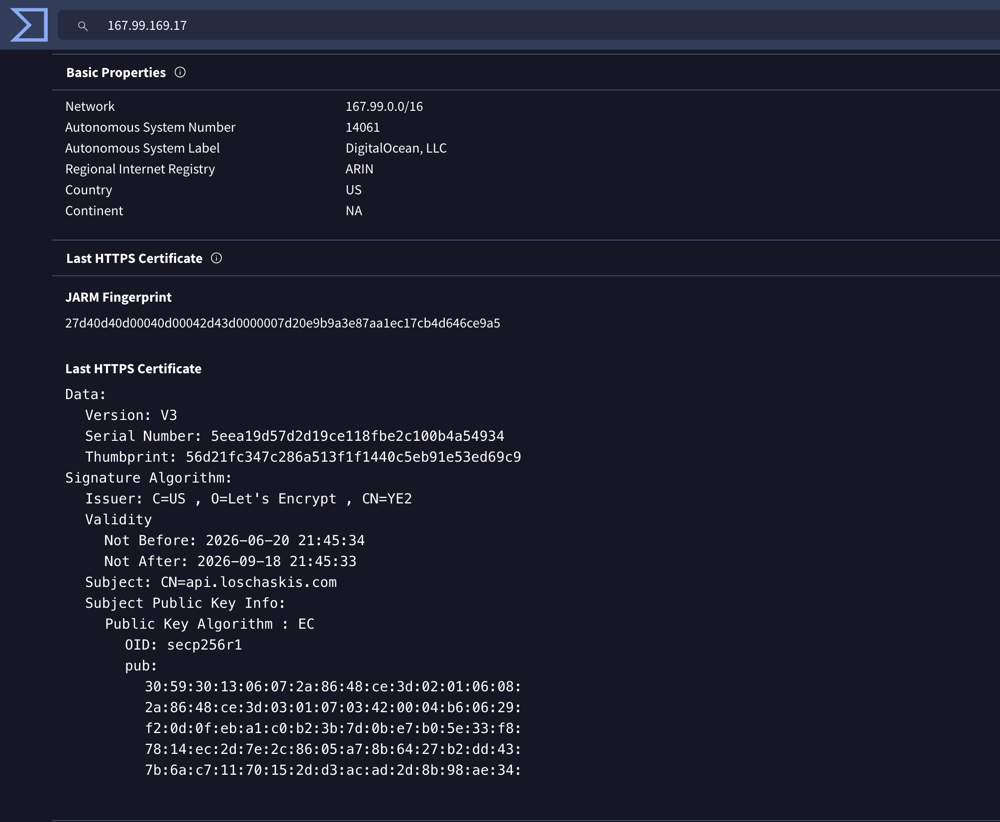
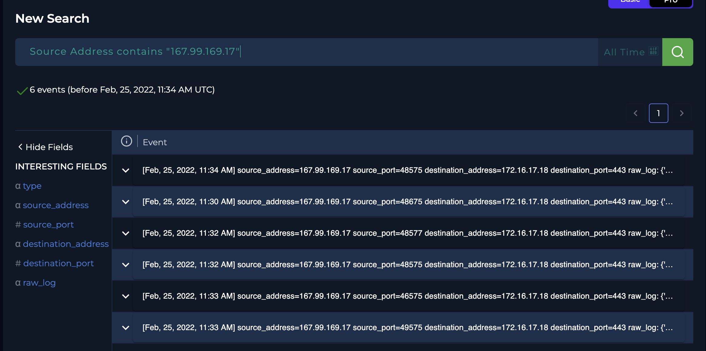
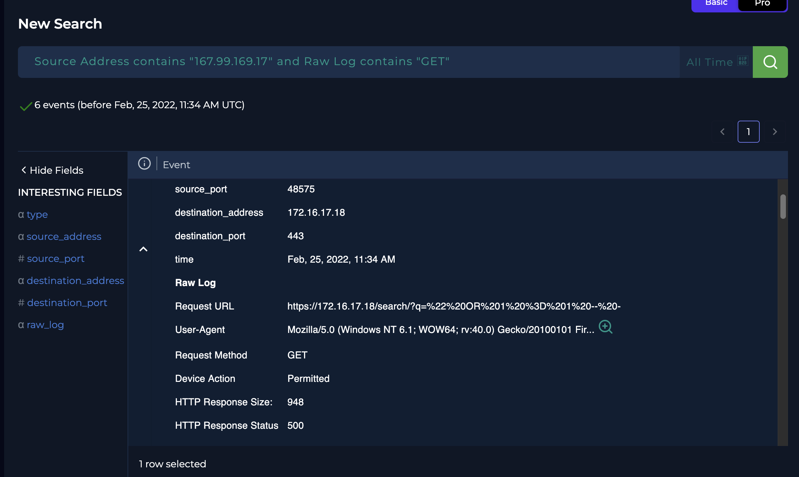
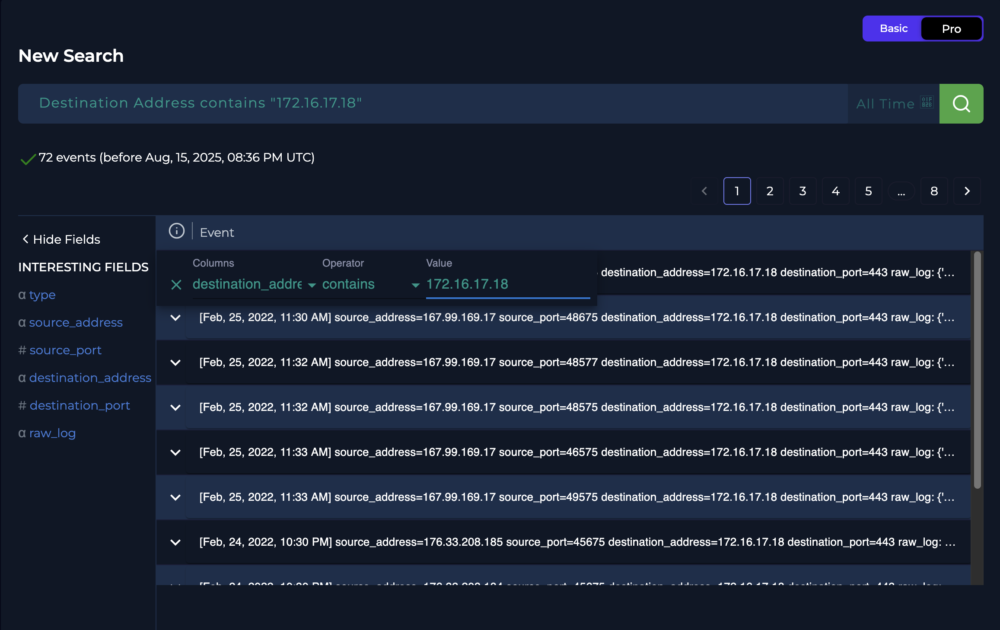
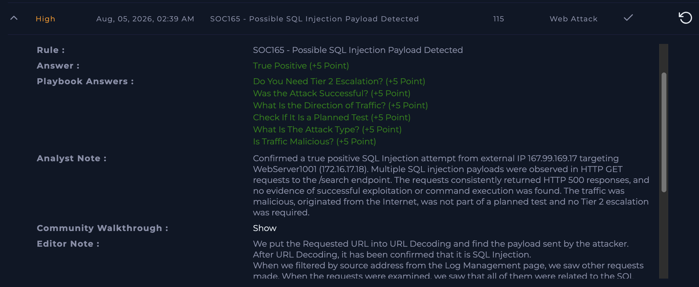

# SOC165 - Possible SQL Injection Payload Detected

> LetsDefend SOC Analyst Investigation Walkthrough

## Scenario

This alert was generated after the detection engine identified a request containing a possible SQL Injection payload. The objective of the investigation was not only to determine whether the alert was a true positive but also to understand the attacker's activity, verify whether the attack succeeded and determine whether further escalation was required.


# Initial Alert Review

The investigation begins by understanding **why the alert was triggered** instead of immediately assuming that the activity is malicious. The detection rule (**SOC165 - Possible SQL Injection Payload Detected**) indicates that a web request matched a known SQL Injection pattern.

The alert provides the following information:

- Source IP: **167.99.169.17**
- Destination Host: **WebServer1001**
- Destination IP: **172.16.17.18**
- Protocol: HTTPS (443)
- HTTP Method: GET

The trigger reason immediately stands out:

> **Requested URL Contains OR 1 = 1**

This strongly suggests a possible SQL Injection attempt, but additional evidence is required before confirming the alert.




# Collecting Initial Intelligence

The next step is gathering contextual information about the source.

The source IP address was investigated using **VirusTotal**.

The lookup shows that the address belongs to **DigitalOcean LLC** and is classified as **malicious** or **suspicious** by several security vendors.

Although reputation alone cannot confirm malicious activity, it provides valuable context for the investigation.



Additional WHOIS information confirms the ASN ownership and network allocation.




# Investigating HTTP Traffic

Following the playbook, all requests originating from the source IP were reviewed inside **LetsDefend Log Management**.

```
Source Address contains "167.99.169.17"
```

Reviewing every request reveals the attacker's behavior rather than focusing on a single event.

Several requests target the **/search** endpoint using classic SQL Injection payloads.

Examples include:

```text
'
```

```text
' OR '1
```

```text
' OR 'x'='x
```

```text
1' ORDER BY 3--
```

```text
" OR 1=1 --
```

Instead of repeating the same payload, multiple SQL Injection techniques were tested against the application.

This behavior is commonly observed when attackers attempt to identify vulnerable SQL queries.




# Examining Server Responses

Recognizing SQL Injection payloads alone is not enough.

The application's responses must also be evaluated.

The normal homepage request returned:

- HTTP Status: **200 OK**
- Response Size: **3547 bytes**

All SQL Injection attempts returned:

- HTTP Status: **500 Internal Server Error**
- Response Size: **948 bytes**

The consistency of these responses is significant.

Successful SQL Injection attacks often result in different response sizes, successful responses or unexpected application behavior.

In this case, every malicious request produced the same server error.

No evidence suggests successful exploitation.




# Comparing Against Normal Traffic

To determine whether this behavior was unique, all traffic targeting the web server was reviewed.

```
Destination Address contains "172.16.17.18"
```

Multiple external IP addresses accessed the homepage normally and received **HTTP 200** responses.

Only **167.99.169.17** repeatedly targeted the **/search** endpoint using SQL Injection payloads.

Comparing malicious traffic with legitimate requests clearly distinguishes the attacker from normal users.




# Investigation Outcome

The collected evidence indicates that:

- Multiple SQL Injection payloads were observed.
- The traffic originated from an external IP.
- The attacker specifically targeted the application's search functionality.
- HTTP responses consistently returned **500 Internal Server Error**.
- No evidence of successful exploitation or command execution was identified.
- No indication of a planned penetration test or security assessment was found.

The traffic is therefore classified as **malicious**, although the attack itself was **unsuccessful**.


# Final Results

| Investigation Question | Result |
|-------------------------|--------|
| Alert Classification | ✅ True Positive |
| Attack Type | SQL Injection |
| Traffic Direction | Internet → Company Network |
| Planned Test | No |
| Successful Attack | No |
| Tier 2 Escalation | No |




# Analyst Note

A True Positive SQL Injection attempt targeting **WebServer1001 (172.16.17.18)** was identified from the external IP address **167.99.169.17**.

Multiple SQL Injection payloads targeting the `/search` endpoint were observed during log analysis. HTTP responses consistently returned **500 Internal Server Error** with identical response sizes, indicating unsuccessful exploitation. No evidence of command execution or post-exploitation activity was identified.

Since the attack originated from the Internet and no compromise occurred, Tier 2 escalation was not required.


# Key Takeaways

This investigation demonstrates that validating web attacks requires more than identifying a malicious payload.

The analysis combined:

- Alert validation
- Threat intelligence
- Log analysis
- HTTP traffic inspection
- Response analysis
- Context comparison

Following the playbook step by step made it possible to distinguish a genuine SQL Injection attempt from a successful compromise and confidently conclude the investigation.
